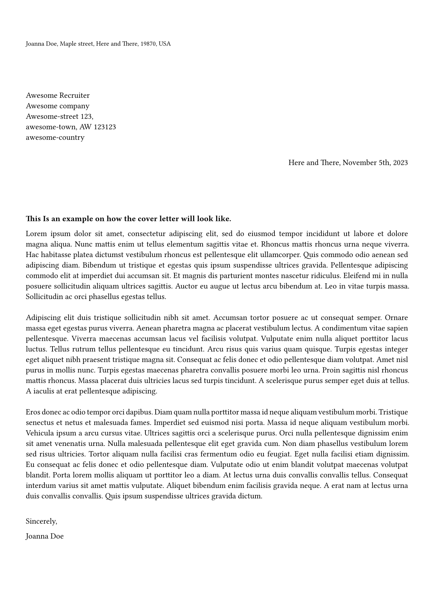

# Markup-Resmue

This project allows you to create a resume (including cover letter) from a markup file (toml, yaml, json, xml) using minimal amounts of `typst` code.

The aim for this project was to allow to define flexible structure so that it can be used to write an internship application just as well as an academic cv or grant application.

This is my first time using typst, please let me know if you spot something in the code that is bad or can be improved.

## Instructions

1. Add [markup-resume-lib](https://github.com/seapat/markup-resume-lib) as a submodule to your own repo
2. Look at [`example.toml`](./example.toml) and [`assets/example.pdf`](./assets/example.pdf) to learn what keywords render which part of the final cv.
3. Check out [`example.typ`](./example.typ) to see how to import your data and what functions you need to call to render a specific part of the cv.
4. Create your own!
    - Instead of `.toml` you can use one of the formats that is [supported by typst](https://typst.app/docs/reference/data-loading/)
    - Alternatively you can also create a dict in typst.
    - Please note that the keywords for the different structural elements are hard-coded and all others will be ignored.

## Example

| Cover Letter | Resume |
| :---: | :---: |
|  |  |

## TODO

- Smart URL parsing
- Ensure some spacing properties
- Support for proper citations (i.e. `.bib` files)
- Support custom icons
    - `icon` per entry, should use some method to insert icons before each entry title among other places
    - [example1](https://github.com/duskmoon314/typst-fontawesome), [example2](https://github.com/Bi0T1N/typst-social), [example3](https://github.com/duskmoon314/typst-fontawesome)
- Use commandline args to provide data directly to the compiler
    - alleviate the need to write own typst code by providing an universal `main.typ` that takes one or more files as input
    - commandline arguments are an upcoming/planned feature

## Credit

- [Picture for the example](https://pixabay.com/vectors/profile-picture-woman-business-woman-7416279/) by Pixabay-user [Winterflow](https://pixabay.com/users/winterflower-17292963/)
